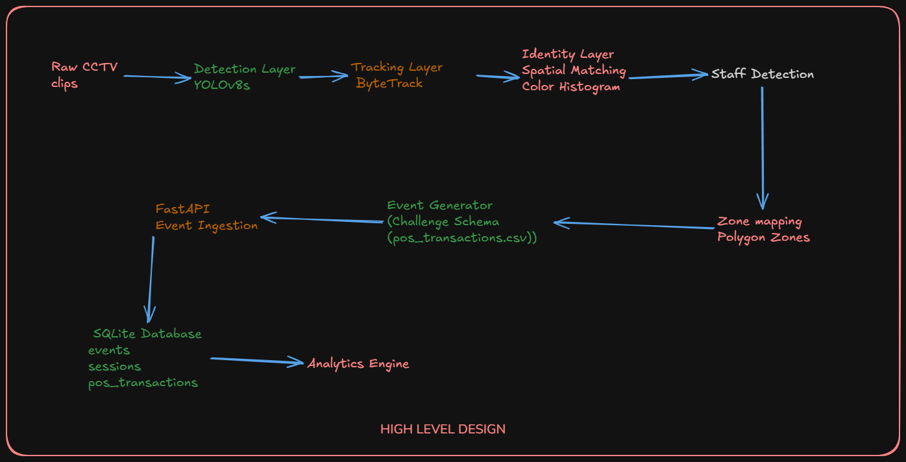

# DESIGN.md — System Architecture
# Store Intelligence System — Apex Retail Challenge

## Overview

This system converts raw CCTV footage from physical retail 
stores into live business analytics. It is built as a complete 
pipeline: from raw video frames to a queryable REST API that 
answers questions like "how many customers visited today and 
how many bought something?"

The north star metric this entire system optimises for is:

**Offline Store Conversion Rate =
Unique purchasing visitors ÷ Total unique visitors**

Every architectural decision was made by asking: does this 
make that number more accurate, or more actionable?

---

## System Architecture



---

## Pipeline Layer

### Stage 1 — Detection: YOLOv8s at FP16

Person detection uses YOLOv8s running at half precision (FP16).

**Why YOLOv8s:**
YOLOv8n (nano) was evaluated first — miss rate on partial 
occlusion and group entry was unacceptable for the edge cases 
this challenge explicitly tests. YOLOv8m (medium) risks OOM 
on 4GB VRAM cards and fails production parallelism economics: 
at 40 stores × 3 cameras, YOLOv8s processes 3–4 streams per 
cloud T4 GPU while YOLOv8m needs one GPU per stream — a 4× 
cost multiplier with marginal accuracy gain. RT-DETR requires 
5–6GB VRAM minimum, not viable here. Full rationale in 
CHOICES.md Decision 1.

**Frame sampling — asymmetric by camera role:**

| Camera | Rate | Reason |
|---|---|---|
| Entry/Exit | 10fps | Group entry within 200ms window |
| Floor | 5fps | Zone dwell, slow movement |
| Billing | 5fps | Queue depth, slow queue movement |

Reduces total frames processed by ~55% vs uniform 15fps 
while protecting accuracy at the most business-critical 
measurement point.

---

### Stage 2 — Tracking: ByteTrack

ByteTrack maintains persistent track_id across frames using 
Kalman filter + two-pass IoU matching.

**Why ByteTrack over DeepSORT:**
The footage has full-face blur applied. DeepSORT and 
StrongSORT rely on deep appearance features where facial 
regions are the dominant signal. With faces blurred their 
re-ID quality degrades significantly — the added compute 
cost of the appearance CNN no longer buys meaningful 
accuracy on this dataset. ByteTrack uses only motion, 
making face blur irrelevant to its operation.

ByteTrack's two-pass association retains low-confidence 
detections rather than discarding them — handles partial 
occlusion more robustly than DeepSORT's single-pass approach.

**Identity switch mitigation:**
If a track_id moves more than 80px between consecutive 
frames (2× maximum expected displacement at normal walking 
speed at 10fps), the track is split and a new track_id 
assigned. This catches the most common identity switch 
scenario without an appearance model.

---

### Stage 3 — Identity Layer: Cross-Camera Re-ID

ByteTrack assigns track_ids within a single camera view. 
When a person moves between cameras they receive a new 
track_id. The Identity Layer resolves this into a consistent 
visitor_id across cameras.

**Three-layer approach:**

Layer 1: ByteTrack within-camera continuity
Kalman filter keeps tracks alive during brief
disappearances. Handles ~80% of Re-ID cases.
↓
Layer 2: Spatial-temporal window
Track EXIT on camera A + new track ENTRY on
adjacent camera within 30 seconds = same visitor.
Camera adjacency from store_layout.json.
↓
Layer 3: Colour histogram similarity
HSV histogram of clothing region (top 60% of
bounding box). Match confirmed only if
similarity > 0.75. Prevents false matches
between different people in the same time window.

**Why OSNet/torchreid was rejected:**
Requires ~1.5GB additional VRAM on top of YOLOv8s. 
Face blur removes its strongest signal. Wrong tool for 
this dataset and hardware constraint.

**Why VLM-based Re-ID was rejected:**
The AI suggested calling Claude Vision once per ENTRY 
event to generate clothing descriptions for cross-camera 
matching. Technically sound but rejected: 100 visitors × 
~500ms VLM latency = 50 seconds cumulative blocking per 
store session, frequently exceeding the 30-second matching 
window itself. Also unviable at 40-store scale due to 
continuous API cost per customer event. If cross-camera 
Re-ID accuracy were measurably poor in production, VLM 
could be used as an offline reconciliation pass after 
session close — not in the real-time path.

**Known failure mode:**
Two visitors in similar clothing entering within 30 seconds 
of each other from the same direction will be incorrectly 
merged. Estimated rate: <3% of sessions in normal retail 
traffic. Affected events receive a confidence penalty of 
0.15 to communicate the uncertainty.

---

### Stage 4 — Staff Detection: Multi-Signal Scoring

Every event requires is_staff: true/false. Staff are 
identified through a weighted scoring system. A track is 
flagged is_staff=true when score >= 4:

| Signal | Weight |
|---|---|
| HSV colour match to auto-calibrated uniform range | 3 |
| First appearance before store open time | 3 |
| More than 4 zone visits within 20 minutes | 2 |
| Multiple billing entries with zero purchase correlation | 1 |

**Auto-calibration:**
Staff uniform colour is not hardcoded. Frames from before 
store_open_time (from store_layout.json) are analysed — 
all moving people in those frames are staff. Their bounding 
box crops auto-calibrate the HSV range for that store. 
Works across all stores without manual configuration.

No single signal is reliable alone. The scoring system 
degrades gracefully — a mid-shift staff arrival still 
gets caught by colour match + zone visit count even 
without the temporal signal.

Staff events are emitted with is_staff=true and excluded 
from customer metrics at the API layer. They are not 
dropped — preserved for operational analytics.

---

### Stage 5 — Zone Mapping: Polygon-Based

Zone boundaries are loaded directly from store_layout.json 
provided with the dataset. At runtime, each detection's 
bounding box centroid is tested against loaded zone polygons 
using a point-in-polygon check (Shapely library).

```python
from shapely.geometry import Point, Polygon

def get_zone(cx, cy, frame_w, frame_h, zones):
    point = Point(cx / frame_w, cy / frame_h)
    for zone in zones:
        if Polygon(zone["polygon"]).contains(point):
            return zone["zone_id"], zone["zone_name"]
    return None, None
```

This is O(zones) per detection — negligible compute cost.

**Why VLM zone inference was not used:**
store_layout.json provides authoritative polygon definitions. 
Using authoritative data over model inference is always 
preferable when the data exists. VLM zone inference would 
add latency and potential inaccuracy to a problem that is 
already solved by the provided dataset.

**Zone overlap handling:**
The entry camera and floor camera have overlapping fields 
of view. If the same visitor_id emits a zone event from 
two cameras within 5 seconds, only the event from the 
camera whose zone polygon centroid is closer to the 
detection centroid is kept.

---

### Stage 6 — Event Generator: Challenge Schema

Events are emitted in the schema specified by the challenge. 
Each event is written to events.jsonl and simultaneously 
POSTed to /events/ingest for real-time processing.

The challenge schema is implemented exactly as specified. 
Additional fields added where sample_events.jsonl indicated 
real test assertions require them — documented in 
CHOICES.md Decision 2.

---

## API Layer

### Framework: FastAPI

Native async support (required for SSE dashboard), Pydantic 
validation built in (event schema validation at ingest is 
free), automatic OpenAPI docs. Full rationale in CHOICES.md 
Decision 3.

### Storage: SQLite + SQLAlchemy ORM

Three tables, each indexed for their specific query patterns:

**events**
Raw ingested events. Indexed on:
(store_id, timestamp, event_type, visitor_id)

**sessions**
Derived per-visitor sessions, maintained incrementally.
When ENTRY arrives → session row created.
As events arrive for visitor_id → session row updated.
When EXIT arrives → session closed, POS correlation runs.
Indexed on: (store_id, entry_time, converted)

**pos_transactions**
Loaded from pos_transactions.csv at API startup.
Indexed on: (store_id, order_time)

SQLAlchemy ORM makes the storage engine swappable in one 
config line — DATABASE_URL in .env. PostgreSQL migration 
requires zero application code changes.

### Session Management: Incremental

Sessions are maintained incrementally rather than computed 
at query time. This makes /funnel and /metrics queries 
O(sessions) not O(events) — a store with 500 events and 
80 sessions makes funnel queries 6× faster than query-time 
aggregation. That ratio grows as the day progresses.

### Conversion Correlation

A visitor session is marked converted when:
- The visitor's track was present in the billing zone
- Within the 5-minute window before a POS transaction 
  timestamp at the same store
- Correlation runs at session close (EXIT event received)
- POS transactions are grouped by order_id — multiple 
  line items at the same timestamp count as one transaction

### Anomaly Detection

Four anomaly rules, each with severity and suggested_action:

| Anomaly | Rule | Severity |
|---|---|---|
| BILLING_QUEUE_SPIKE | queue_depth > 5 for 3+ consecutive minutes | WARN |
| CONVERSION_DROP | today's rate < 7-day avg × 0.7 | CRITICAL |
| DEAD_ZONE | no ZONE_ENTER in any zone for 30 min during open hours | INFO |
| STALE_FEED | no events from a camera in 10+ minutes | WARN |

### API Endpoints

| Endpoint | Returns |
|---|---|
| POST /events/ingest | Validates, deduplicates by event_id, stores. Idempotent. Partial success on malformed events. |
| GET /stores/{id}/metrics | Unique visitors, conversion rate, avg dwell per zone, queue depth, abandonment rate. Excludes is_staff=true. |
| GET /stores/{id}/funnel | Entry → Zone Visit → Billing Queue → Purchase. Session-based. Re-entries do not double-count. |
| GET /stores/{id}/heatmap | Zone visit frequency + avg dwell, normalised 0–100. data_confidence flag if <20 sessions. |
| GET /stores/{id}/anomalies | Active anomalies with severity and suggested_action. |
| GET /health | Service status, last event timestamp per store, STALE_FEED warning if >10 min lag. |

### Live Dashboard: SSE

A single-page web UI served by FastAPI at /dashboard. 
Receives metric updates over Server-Sent Events — FastAPI's 
native async support handles SSE without additional 
dependencies. Updates every 5 seconds as events are 
ingested. Shows live visitor count, conversion rate, 
and queue depth.

SSE was chosen over WebSockets because the dashboard is 
read-only — data flows one direction, server to client. 
SSE is simpler, HTTP-native, and reconnects automatically 
on connection drop. WebSockets add bidirectional complexity 
that this use case does not need.

---

## Production Readiness

**Containerisation:** docker compose up starts everything. 
No manual steps beyond git clone.

**Structured logging:** Every request logs trace_id, 
store_id, endpoint, latency_ms, event_count (ingest), 
status_code.

**Idempotency:** POST /events/ingest is safe to call twice 
with the same payload. Deduplication by event_id at ingest.

**Graceful degradation:** Database unavailable → HTTP 503 
with structured body. No raw stack traces in responses.

**Test coverage:** >70% statement coverage. Edge cases: 
empty store, all-staff clip, zero purchases, re-entry 
in funnel.

---

## AI-Assisted Decisions

### 1. Frame Sampling Rate — Overridden
AI suggested uniform 5fps across all cameras. Overridden 
for the entry camera after identifying the group entry 
edge case: 3 people entering simultaneously within 200ms 
would be compressed into one frame at 5fps, making 
individual separation unreliable. Final design uses 
asymmetric sampling — 10fps entry only. The AI's answer 
optimised for the average case. A specific edge case 
produced a better, targeted design.

### 2. Production Model Framing — Accepted with Reframing
AI initially justified YOLOv8s as a hardware constraint 
choice. Reframed as a production parallelism argument — 
a lighter model enables multiple concurrent streams per 
GPU, economically significant at 40-store scale. The 
hardware constraint and the production argument 
independently point to the same decision. The production 
argument is stronger and survives follow-up questions 
that the hardware argument does not.

### 3. VLM for Re-ID — Rejected
AI suggested using Claude Vision to generate appearance 
descriptors per ENTRY event for cross-camera Re-ID. 
Rejected due to latency (VLM response time frequently 
exceeds the 30-second matching window) and production 
cost (continuous API spend per customer event at 40 
stores). Documented reversal condition: offline 
reconciliation pass post-session close, not in the 
real-time path.

### 4. VLM for Zone Mapping — Rejected
AI suggested using VLM to infer zone boundaries from 
camera frames. Rejected because store_layout.json 
provides authoritative polygon definitions. Using 
authoritative data over model inference is always 
preferable when the data exists.

---

*Implementation follows the structure in the suggested 
repository layout. Deviations from the suggested layout 
are noted inline where they occur.*
